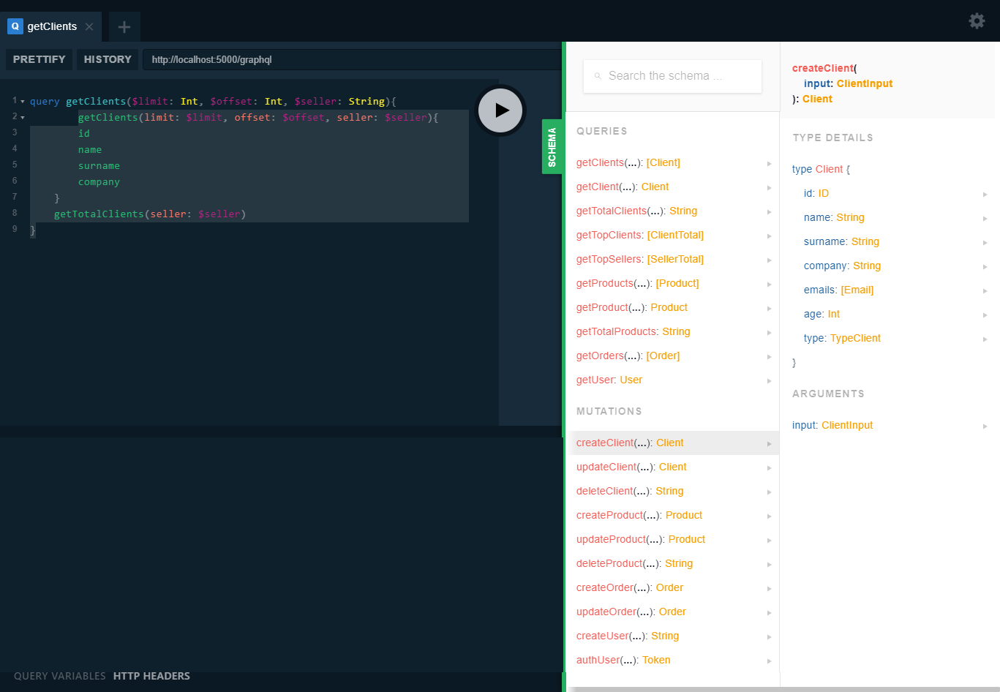

<h1 align="center">
   
  
   
  CMS - Backend 
   
</h1>
<h4 align="center"><a target="_blank" href="https://github.com/martinbobbio/frontend-cms">CMS - Frontend</a></h4>

# Descripción

Prácticas llevadas a cabo integrando GraphQL conectando con Apollo Server a mi servidor de NodeJS. Aplicando las últimas tecnologías de javascript, jwt, mongo.

# Capturas

### Consola

